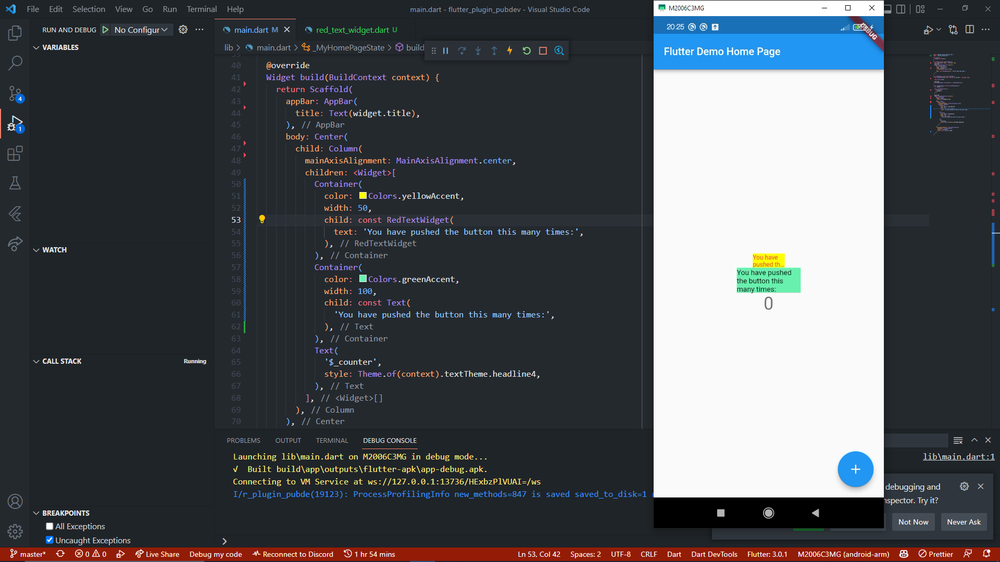

# flutter_plugin_pubdev

Praktukum Modul 22 TSA Mobile Flutter Program

# Praktikum

# Penjelasan

1. Pada praktikum langkah kedua, dilakukan penambahan library auto_size_text pada project menggunakan perintah flutter pub add auto_size_text, library ini digunakan untuk mengatur tampilan text sesuai jumlah baris yang diinputkan pada parameter class dari library tersebut. Pada contoh ini max line yang diberikan adalah 2 baris sehingga ketika jumlah teks yang diberikan melebihi kapasitas maka ukuran teks akan berkurang dan apabila masih kurang kecil maka dimunculkan elipsis (tiga titik).
2. Pada praktikum langkah kelima, dilakukan penambahan variable dan konstruktor berupa string yang nantinya akan ditampilkan dengan bantuan library AutoSizeText.
3. Kedua widget yang ditambahkan adalah Container. Pada container pertama child diisi dengan widget class RedTextWidget untuk mendemonstrasikan contoh penggunaan library AutoSizeText. Pada container kedua child diisi dengan widget text biasa untuk melihat perbedaan tampilan hasil antara widget text biasa dan widget class RedTextWidget.
4. Parameter pertama yakni string text yang akan ditampilkan pada widget AutoSizeText, lalu ada style yang digunakan untuk mendefinisikan style dari text yang diinputkan, selanjutnya adalah maxLines yang digunakan untuk membatasi jumlah baris yang ditampilkan pada widget AutoSizeText, terakhir adalah parameter overFlow yang digunakan untuk menentukan tampilan ketika jumlah baris yang ditampilkan melebihi kapasitas yang ditentukan pada maxLines, di sini menggunakan TextOverflow elipsis, agar ketika jumlah baris melebihi kapasitas maka ditampilkan tiga titik.
